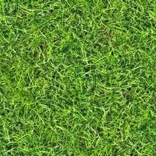
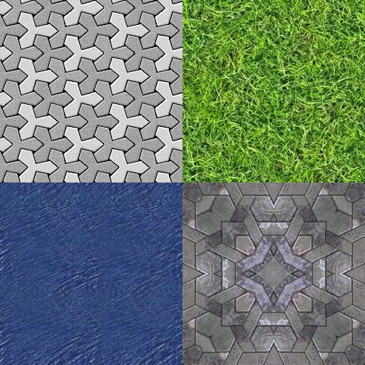
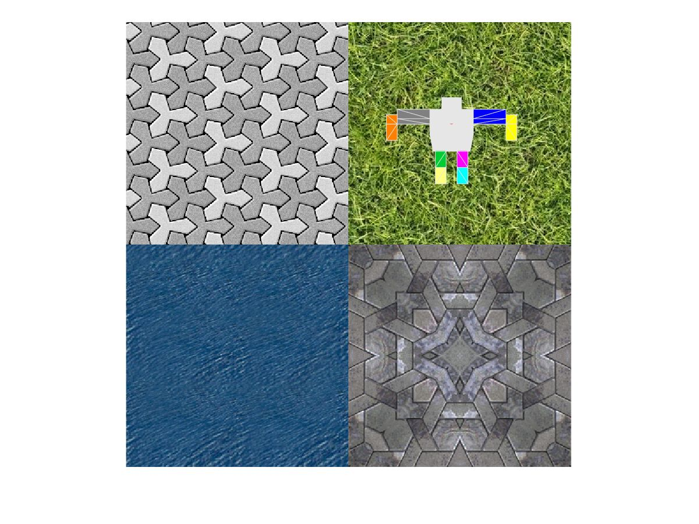
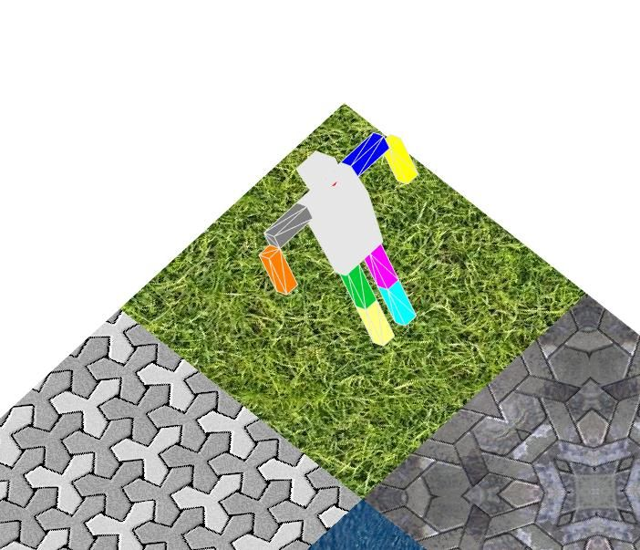
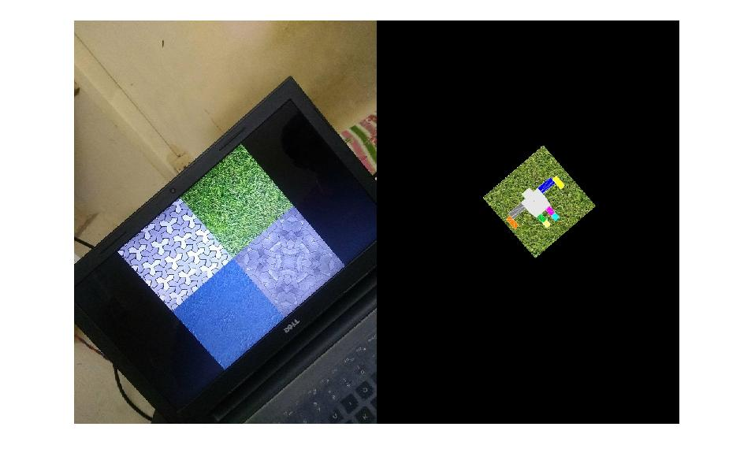

Implementing Augmented Reality 3D object after Texture detection:
=================================================================

 Implement pre-trained texture detection in any test image and then
overlay the image with a 3D model over it. 

 Once the 3D model is placed over a given test image, it can be placed
over a sequence of test images to get a video of AR. 

 
 
 
 
 Files used and the code they contain:

-   **getHumanoidCoordinates.m​** : Returns 3 matrices - vertex
    coordinates, triangle face orders, color of each vertex. It
    represents a 3D model of a humanoid robot. 
-   **drawMesh.m​** : Draws the 3D model over the test image.
-   **getHomography.m**​ : Computes and return a 4X4 homography matrix,
    given a texture and the test image.
-   **applyHomography.m​** : Multiplies the 4X4 homography matrix to the
    vertex coordinates after making them homogeneous, to place the 3D
    model at correct place and in proper orientation over the input test
    image. Returns back new 3D coordinates.
-   **myAR.m** : main file to run the project.

 
 
 A sample example: 
 **Texture plane to be detected:** 
 
  
 
 **Test Image:** 
 
  
 
 **Final Image:** 
 
  
 
  
 

What have we achieved:
----------------------

 We were not able to find the transformation to place a 3D model over a
2D object detected. It has several issues. A article of stackoverflow
discusses these: [Transformation matrix of a 3d model to object in a 2d
image](https://stackoverflow.com/questions/42608708/how-to-get-the-transformation-matrix-of-a-3d-model-to-object-in-a-2d-image)

 Then we moved on to place a 2D image instead of the 3D model over the
detected area. For object detection we referred to the article: [Object
Recognition and Tracking for Augmented
Reality](https://in.mathworks.com/videos/object-recognition-and-tracking-for-augmented-reality-90546.html)

 In that we were not able to place the transformed image over the
original image. So we have applied the transformation and showed it
alongside the image. 

 Here are some results: 
 
 
